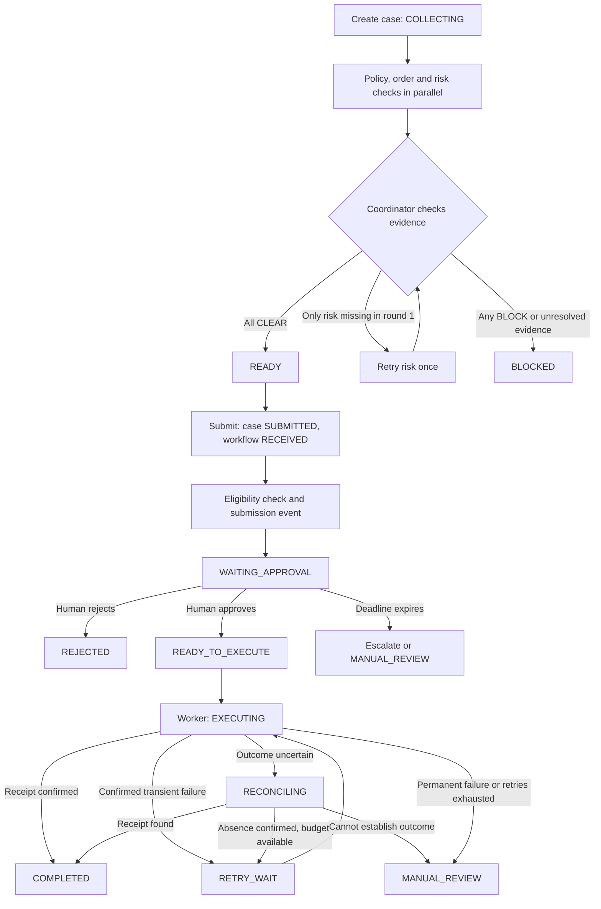

# Workflow Orchestration

This guide explains the refund lab from beginning to end. The example requests an INR 18,000 refund on an INR 50,000 order delivered five days ago. The ERP is a local simulation.

## The full journey



Submission can also be rejected by the eligibility check before an approval task is created.

## 1. Create a refund case

`app.team new` creates the sample order and an `agent_cases` record in `COLLECTING`. Its facts are divided into policy, order and risk evidence. The case ID identifies specialist work; the later workflow ID identifies human approval and refund execution. They are different IDs.

## 2. Collect three specialist results in parallel

`collect_parallel` in `app/team_starter.py` starts all three checks together. Each specialist receives its own scoped evidence.

| Specialist | Question | Healthy example |
|---|---|---|
| Policy | Within the refund window and eligible category? | Five days is within 45 days; standard category |
| Order | Is the refundable balance sufficient? | INR 18,000 is within INR 50,000 remaining |
| Risk | Does the evidence show an anomaly? | No anomaly |

Each valid response contains `verdict`, `evidence_ref`, and `finding`. Verdicts are `CLEAR`, `BLOCK`, or `REVIEW`. The app validates the exact response shape, evidence reference, and whether a CLEAR verdict contradicts the source facts. Exceptions, invalid output and deadlines become `ERROR` results. Tasks and results are saved in PostgreSQL.

The `fixture` backend supplies deterministic sample responses. The optional `openai` backend calls a live model and needs a configured API key. Use fixtures for the failure drills.

## 3. Coordinate the evidence

`supervise` in `app/team_starter.py` applies these rules in order:

1. Any `BLOCK` wins: the case becomes `BLOCKED`.
2. All three checks `CLEAR`: the case becomes `READY`.
3. Only risk is missing or unsuccessful on round one: issue `FOLLOW_UP` and retry risk once, keeping policy and order results.
4. Any other incomplete evidence, or risk still missing after the retry: `BLOCKED`.

The coordinator stores each decision and its input evidence. A READY case receives an evidence snapshot. **READY is permission to request human review, not approval to refund.**

## 4. Submit for human review

`app.team submit` verifies case ownership, READY status, order and amount. It creates a workflow in `RECEIVED`, copies the specialist snapshot into its proposal, and changes the case to `SUBMITTED`.

The app checks eligibility again. For an eligible request, it records `workflow.submitted` in the database outbox. The publisher sends it through Redis/Celery; the worker consumes it and creates the approval task and timer. The workflow becomes `WAITING_APPROVAL`.

## 5. A human decides

| Refund amount | Initial approver |
|---|---|
| Up to INR 7,500 | Support Lead |
| Above INR 7,500 through INR 25,000 | Finance Manager |
| Above INR 25,000 | Finance Director |

The INR 18,000 example requires a Finance Manager. Approval checks the actor's role, prevents self-approval, validates proposal/task versions, and rejects expired or closed tasks. A reason is required.

- Approve: `READY_TO_EXECUTE`, with an approval event that schedules execution.
- Reject: `REJECTED`.
- Deadline expires: the scheduler escalates Support Lead to Finance Manager, then Finance Director. Expiration at the final role leads to `MANUAL_REVIEW`.

Stopping the scheduler does not make late approval valid: the decision handler independently checks the database deadline.

## 6. Execute and recover

The worker claims a saved execution attempt, marks the workflow `EXECUTING`, and calls the simulated ERP outside the database transaction.

| Outcome | Behavior |
|---|---|
| Confirmed refund receipt | `COMPLETED` |
| Transient failure confirmed before any refund | `RETRY_WAIT`, with a maximum of three attempts |
| Lost response or expired execution lease | `RECONCILING`; look up the ERP result |
| Receipt found during reconciliation | `COMPLETED`, without issuing another refund |
| ERP confirms no refund exists | Retry with the same operation key if the attempt budget allows |
| Permanent rejection, exhausted budget or indeterminate provider status | `MANUAL_REVIEW` |

The stable operation key makes repeated requests for the same refund identifiable to the ERP. Inbox records deduplicate delivered events; outbox records retain events awaiting publication. The database also keeps decisions, attempts, receipts and audit history.

## Which service does what?

| Service | Responsibility |
|---|---|
| `api` | Dashboard, HTTP endpoints and container for CLI commands |
| `db` | PostgreSQL: durable cases, evidence, workflows and audit history |
| `redis` | Celery message broker and result backend |
| `publisher` | Sends database outbox events to Celery |
| `worker` | Consumes events, executes refunds and runs recovery checks |
| `scheduler` | Processes approval deadlines and escalation |
| `erp` | Local refund provider simulation |

Specialist orchestration runs when you invoke `app.team run`; it is distinct from the background refund worker.

## How to run the app from the terminal (PowerShell)

Follow these steps in order in the same PowerShell terminal. In VS Code, select **Terminal > New Terminal** and choose PowerShell. Run one command at a time and resolve any error before continuing. This walkthrough uses simulated specialist responses and a local simulated refund; no OpenAI API key or local Python installation is needed.

### Step 1. Open the project folder

```powershell
Set-Location 'C:\Users\ghumt\OneDrive\Desktop\july-cohort-bootcamp\multi-agent-orchestration'
```

All following Docker Compose commands must run from this folder, which contains `compose.yaml`.

### Step 2. Start Docker Desktop and check it is ready

Open Docker Desktop from the Windows Start menu and wait until its engine is running. Then check:

```powershell
docker --version
docker compose version
docker info --format '{{.ServerVersion}}'
```

The last command should print a server version. If it reports that the engine or named pipe cannot be found, wait for Docker Desktop to finish starting and try again.

### Step 3. Build and start the app

```powershell
docker compose up -d --build
docker compose ps
```

The first build downloads images and installs dependencies, so it can take several minutes. Expect all seven services to be running; PostgreSQL and Redis should show healthy. The `-d` option leaves them running in the background. The fixture demo does not require a `.env` file.

### Step 4. Seed the classroom data and check the app

```powershell
docker compose exec -T api python -m app.seed
Invoke-RestMethod 'http://localhost:8098/health'
docker compose exec -T api python -m unittest discover -s tests -v
```

Seeding creates the classroom identities and is safe to repeat. The health response should say `ok`; the two lab tests should pass. These tests check the collection and coordinator functions, not a complete refund.

### Step 5. Open the dashboard

```powershell
Start-Process 'http://localhost:8098'
```

You can also open <http://localhost:8098> manually. Keep the terminal open for the next steps. A new installation will have no workflows until you create and submit one.

### Step 6. Create a healthy case and save its ID

```powershell
docker compose exec -T api python -m app.team new healthy
```

Find the output line `CASE_ID=...`. Copy only the UUID after the equals sign and replace the placeholder below, keeping the quotes:

```powershell
$caseId = 'paste-your-case-uuid-here'
```

### Step 7. Run the three specialists and inspect their results

```powershell
docker compose exec -T api python -m app.team run $caseId --backend fixture
docker compose exec -T api python -m app.team show $caseId
```

Expect policy, order and risk to return `CLEAR`, and the case status to become `READY`. This means it is ready to request human approval. No refund has been executed.

### Step 8. Submit the READY case and save its workflow ID

```powershell
docker compose exec -T api python -m app.team submit $caseId --seconds 600
```

Find `WORKFLOW_ID=...`. Copy its UUID into a different variable:

```powershell
$workflowId = 'paste-your-workflow-uuid-here'
docker compose exec -T api python -m app.cli show $workflowId
```

The background worker should move the workflow from `RECEIVED` to `WAITING_APPROVAL`. If it still says `RECEIVED`, wait a few seconds and repeat the `show` command. The approval task has a 600-second (10-minute) deadline starting when it is created.

### Step 9. Review and approve the simulated refund

In the dashboard, select **ACME** and **Finance Manager**, then review the INR 18,000 proposal and its specialist evidence. Once the workflow is `WAITING_APPROVAL`, approve either in the dashboard or with this terminal command:

```powershell
docker compose exec -T api python -m app.cli approve $workflowId --role finance_manager --reason 'Checked INR 18000 and specialist evidence'
```

Use one approval method. If the deadline has elapsed, inspect the workflow to see whether it has escalated; the old Finance Manager task cannot approve it. For a fresh practice run, start again at Step 6 with a new case.

### Step 10. Wait for the result and inspect the history

```powershell
docker compose exec -T api python -m app.cli wait $workflowId
docker compose exec -T api python -m app.cli show $workflowId
```

For the healthy example, expect `COMPLETED` and a recorded provider receipt. The detailed output includes approval tasks, decisions, execution attempts and audit events. A CLI wait timeout does not cancel or erase the workflow; inspect it again.

### Step 11. View logs if something is not working

```powershell
docker compose ps
docker compose logs --tail 80 api worker publisher scheduler
```

For continuously updating logs, use `docker compose logs -f`. Press **Ctrl+C** to stop following logs; the containers keep running. If a prior drill left services stopped, run `docker compose start worker scheduler`.

### Step 12. Stop the app and restart it later

```powershell
docker compose stop
```

This keeps the database and demo history. To start again from this folder:

```powershell
docker compose up -d --build
```

After opening a new terminal, repeat Step 1. PowerShell variables do not persist between terminals: restore `$caseId` and `$workflowId` from your saved IDs, or create a fresh case starting at Step 6. After GitHub updates, review the updated setup notes and rebuild using the command above.

## Scenario notes, including the latest professor update

Use a fresh case for each exercise and capture its own case ID and workflow ID before inspecting or approving it.

| Scenario | Expected result |
|---|---|
| `healthy` | All CLEAR, then READY |
| `risk_timeout` | FOLLOW_UP for risk, then READY on round two |
| `conflict` | Order specialist blocks because the order is already fully refunded |
| `missing_risk` | Risk fails both rounds; BLOCKED |
| `malformed` | Invalid policy response becomes ERROR; BLOCKED |

**Worker stopped:** Prepare and submit a READY case. Wait for its approval task to exist, then run `docker compose stop worker`. Approve while the task is still valid. The approval persists, but execution waits. Run `docker compose start worker`, then inspect or wait for the workflow to finish.

**Scheduler stopped and late approval:** Stop the scheduler, prepare a fresh READY case, and submit with `--seconds 120 --fault lost_response`. Capture the new workflow ID. Wait for `WAITING_APPROVAL`, stop the worker, and allow the actual approval deadline to pass. A Finance Manager approval must then fail, even though the scheduler is stopped. Restart the scheduler, inspect the newly escalated Finance Director task, and approve that task before its deadline. Restart the worker. The injected lost response exercises reconciliation against the simulated ERP. Stopping the scheduler alone does not create a late approval; the deadline must actually pass.

Restore both services after drills with `docker compose start worker scheduler`. See [the professor's README](README.md) for the exercise commands; assign the workflow ID before any command that uses it.

## Source map and maintenance

| Source | What to check when updating these notes |
|---|---|
| `app/team.py`, `app/team_starter.py`, `app/graph.py`, `app/llm.py` | Cases, specialists, coordinator, backends |
| `app/core.py`, `app/exercises.py` | Submission, approval, execution, escalation, recovery |
| `app/runtime.py`, `app/celery_app.py` | Publisher, scheduler and worker responsibilities |
| `app/api.py`, `app/cli.py`, `app/dashboard.html` | User interactions and commands |
| `compose.yaml`, `sql/`, `README.md`, `tests/test_labs.py` | Setup, persistence and exercises |

Last reviewed: 2026-09-27, against professor's upstream commit `391b9ea`. Initial guide checked against the implementation and professor's `32f59d3` scenario update. Includes worker downtime, late approval, and lost-response recovery. Scenario descriptions are expected behavior; they are not a claim that every drill has been run.

2026-09-26 documentation update: expanded the terminal walkthrough into 12 numbered PowerShell steps, including Docker readiness, ID handling, expected results, logs, and stopping/restarting. No application behavior changed.

2026-09-27 upstream review: merged `391b9ea`, which adds the separate [A2A, MCP, skills and streaming lab](../a2a-mcp-skills-streaming/README.md). The only upstream change inside `multi-agent-orchestration` is macOS `.DS_Store` metadata; its code, README, tests and Compose configuration are unchanged. Rechecked this guide's commands against the CLI parsers and Compose services, and its collection and coordination rules against `app/team_starter.py`. No workflow change was needed. The new lab's `READY_FOR_REVIEW` outcome does not execute a refund; use its own README for setup and exercises. Runtime drills were not rerun for this documentation review.

After relevant code edits or GitHub updates, review and update this guide in the same task, following [repository instructions](../AGENTS.md). These instructions do not run a background watcher for changes made outside an assistant session.
